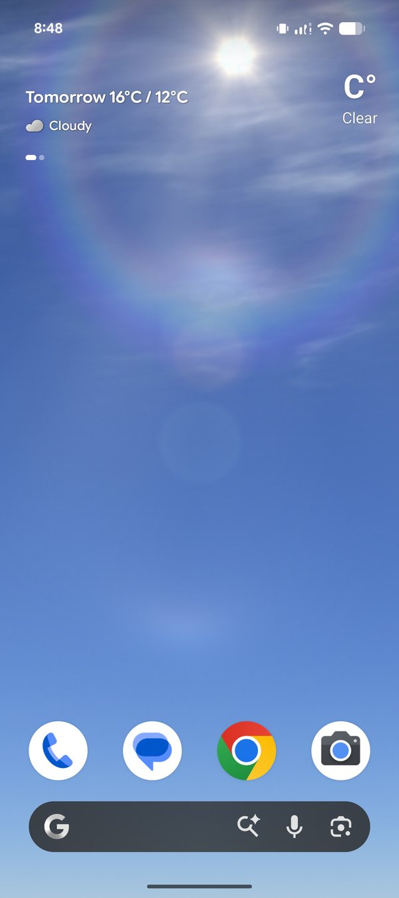
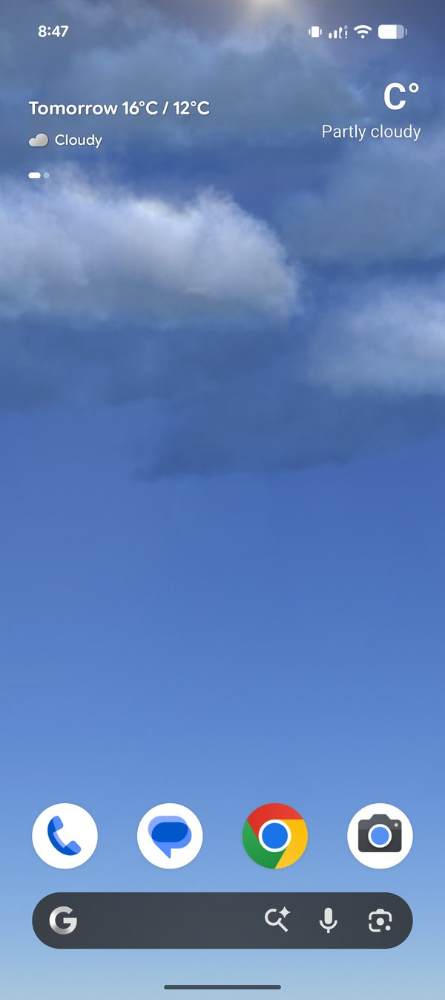
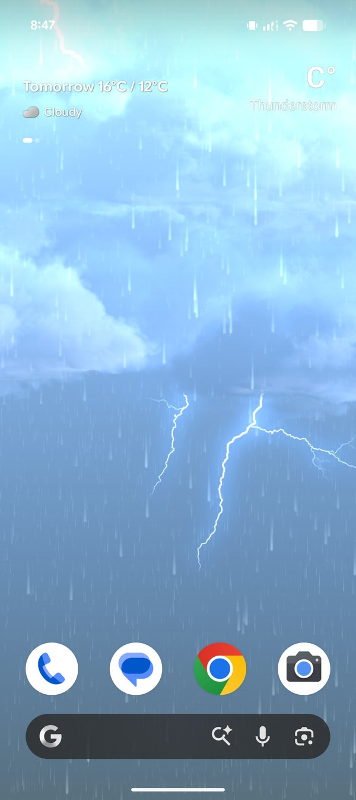
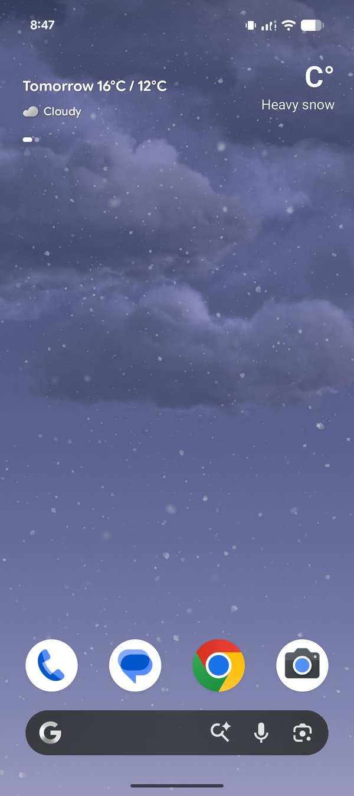
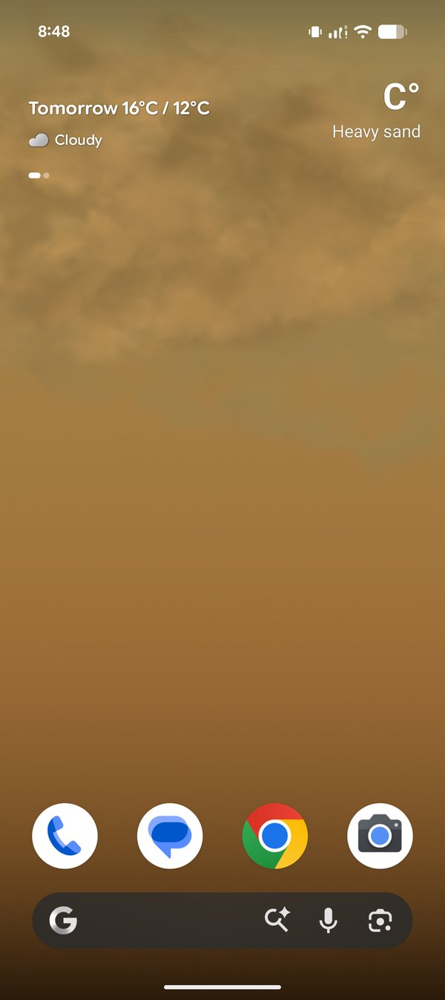
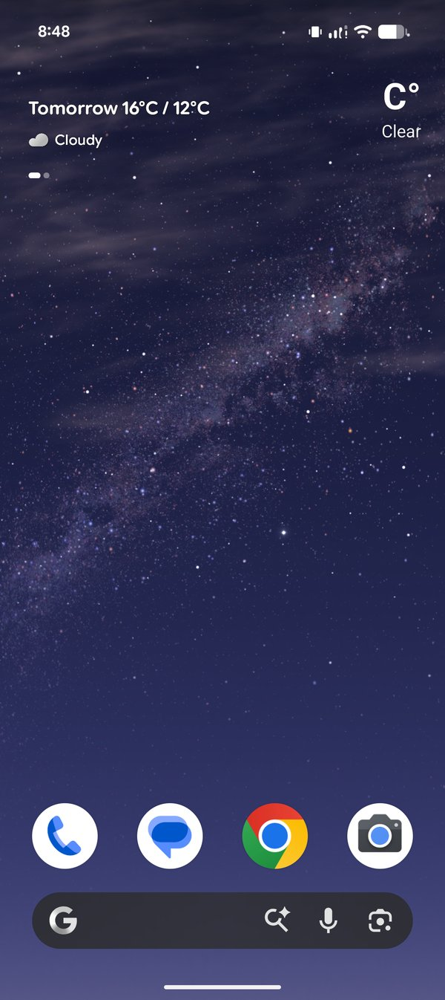

# SkyFlow — Live Weather Wallpaper

A personal live-wallpaper experiment that brings the beautiful MIUI weather experience to your Android home screen — ever-changing skies, majestic clouds, gentle transitions, and rich colors that follow your local weather and the time of day.

> **Download the latest APK from the [Releases page](../../releases).**
> Sideloading requires allowing "install from unknown sources" for your browser or file manager.

## Screenshots

  
  
  

  <strong>Clear</strong> · <strong>Partly cloudy</strong> · <strong>Thunderstorm</strong>

  
  
  

  <strong>Heavy snow</strong> · <strong>Heavy sand</strong> · <strong>Milky Way (night)</strong>

## What it does

- **Real-time weather** — the scene reflects the current conditions at your location: cloud cover, rain, snow, and clear skies.
- **Time-of-day sky** — physically-modelled atmospheric color that shifts through sunrise, day, sunset, and night.
- **Weather effects** — layered rain and snow, lightning during storms, sun glare, rainbows, a starfield at night, and the occasional galaxy.
- **Smooth transitions** — conditions cross-fade rather than snap, so the wallpaper changes gracefully as the weather does.
- **Location-aware** — uses your device location, or a city you pick, to fetch local weather.
- **Efficient** — a fixed-rate renderer with steady, bounded memory use.

## Supported devices

- Android with arm64-v8a or armeabi-v7a (essentially all current phones).
- Android 8.0 (Oreo) and above.
- Requires location permission for automatic local weather; a manual city selection is available if you prefer not to grant it.

## Security & privacy

SkyFlow is built with a published security process. The reports in [`security/`](security/) are generated from automated scans of the source and the built app:

- **Dependency scanning** — third-party libraries checked for known vulnerabilities (Dependabot).
- **Static analysis** — the source and APK scanned for insecure patterns each release (mobsfscan + MobSF).
- **Signed releases** — every APK is signed with a stable release key, so updates are verifiably from the same author.

See the [security scan summary](security/) for the findings and an honest breakdown of what each flag means.

**Privacy:** SkyFlow requests location to fetch local weather. What it accesses and how it uses it is described in [`PRIVACY.md`](PRIVACY.md).

## About this project

SkyFlow is a personal, non-commercial experiment — a fan's attempt to bring the beautiful MIUI weather experience onto an Android live wallpaper, so people like me can enjoy ever-changing weather with gentle transitions, majestic clouds, and rich sky colors throughout the day.

The weather visuals are closely derived from MIUI's weather designs, recreated for learning and personal enjoyment. This project is **not affiliated with, endorsed by, or connected to Xiaomi or MIUI**, and all rights to the original MIUI weather designs remain with Xiaomi. The application code and engine are the author's own work; the visual designs are not.

If Xiaomi requests removal, this project will be taken down without hesitation.

## License

The **source code** for this project (the rendering engine, build tooling, and app logic) is the author's own work. The **visual designs and weather artwork** are derived from MIUI and remain the property of Xiaomi — they are not offered for reuse. Please do not redistribute the artwork or ship it in other apps.

## Feedback

Questions and bug reports are welcome in [Issues](../../issues).
